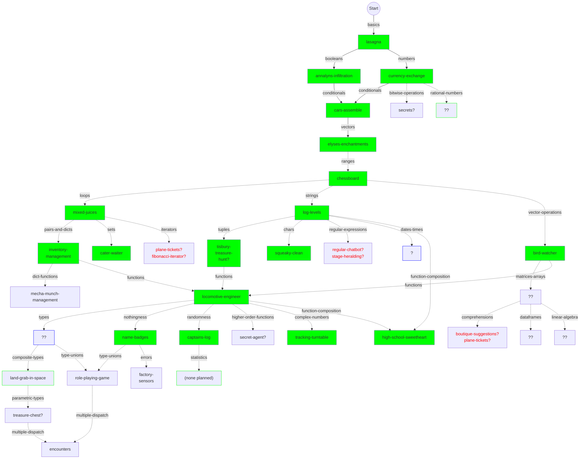

# Concept tree for Julia learning mode

This is a very fluid plan and will doubtless continue to change frequently!

Boxes with green borders have the exercise + concept PRs submitted.
Blue borders mean only the concept PR is submitted.
Solid green means both are merged.

Red text mean we need to decide between plausible exercises from another tracks.

## Other concepts to add

- macros
- modules
- and more??
