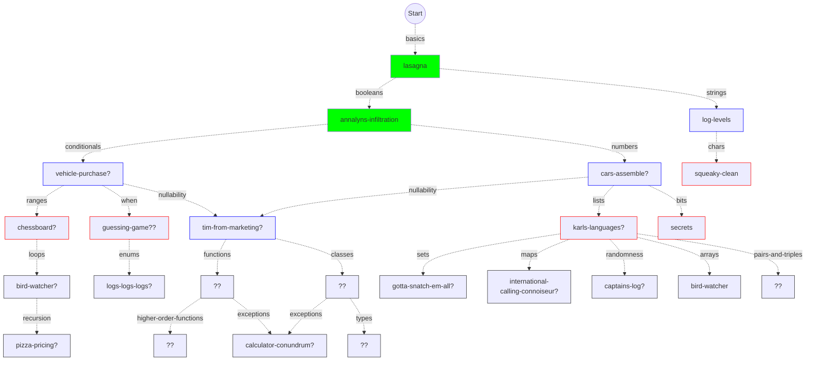

# Concept tree for Kotlin learning mode

This is a very fluid plan and will doubtless continue to change frequently!

Boxes with red borders have a draft `about.md` available.

Boxes with green borders have the exercise + concept PRs submitted.
Blue borders mean only the concept PR is submitted.
Solid green means both are merged.

Red text means we need to decide between plausible exercises from other tracks.

## Some special features of Kotlin

The Java syllabus is useful as a starting point for a Kotlin equivalent.
However, Kotlin is a big, modern, multi-paradigm language with many features that are still absent from Java.

This is a very preliminary list, which ~~may~~ will certainly need correction by someone with more experience of modern Java:

- Nullable types
  - non-nullable is the default 
  - the safe-call operator `?.`
  - the Elvis operator `?:`
- `when` for pattern matching
- Function call syntax
  - named arguments
  - default arguments
- Functional programming support
  - functions as arguments and return values
  - higher-order functions 
  - lambdas
- Data classes
- Objects as static classes
- Extension functions
- Coroutines, for asynchronous programming

