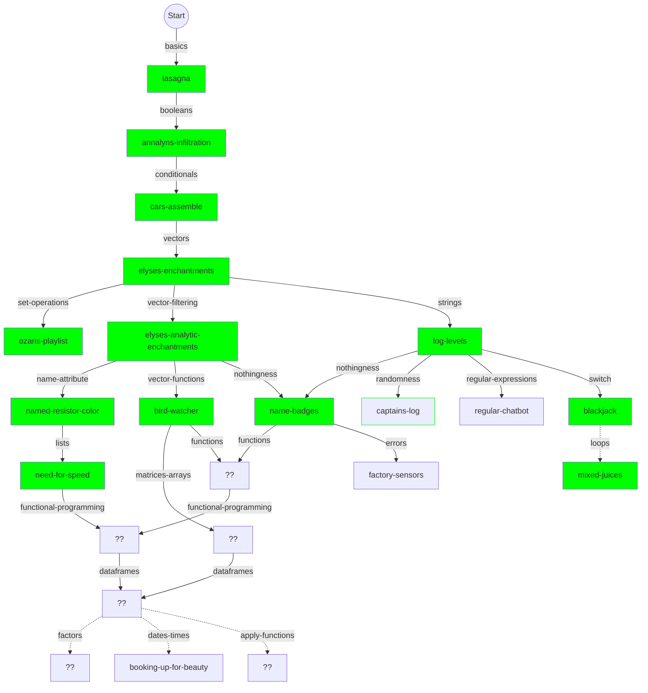
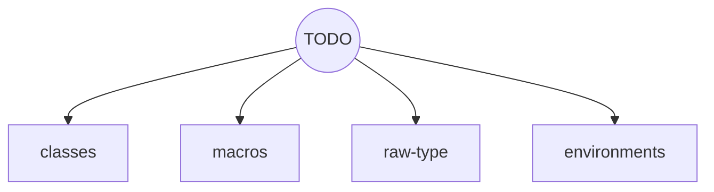

# Concept tree for R learning mode

## Some that are already in progress or planned

This is a very fluid plan and will doubtless continue to change frequently!

Boxes with green borders have the exercise + concept PRs submitted.
Solid green means both are merged.

This isn't quite as tangled as it may appear.

## Some future concepts to be slotted in

